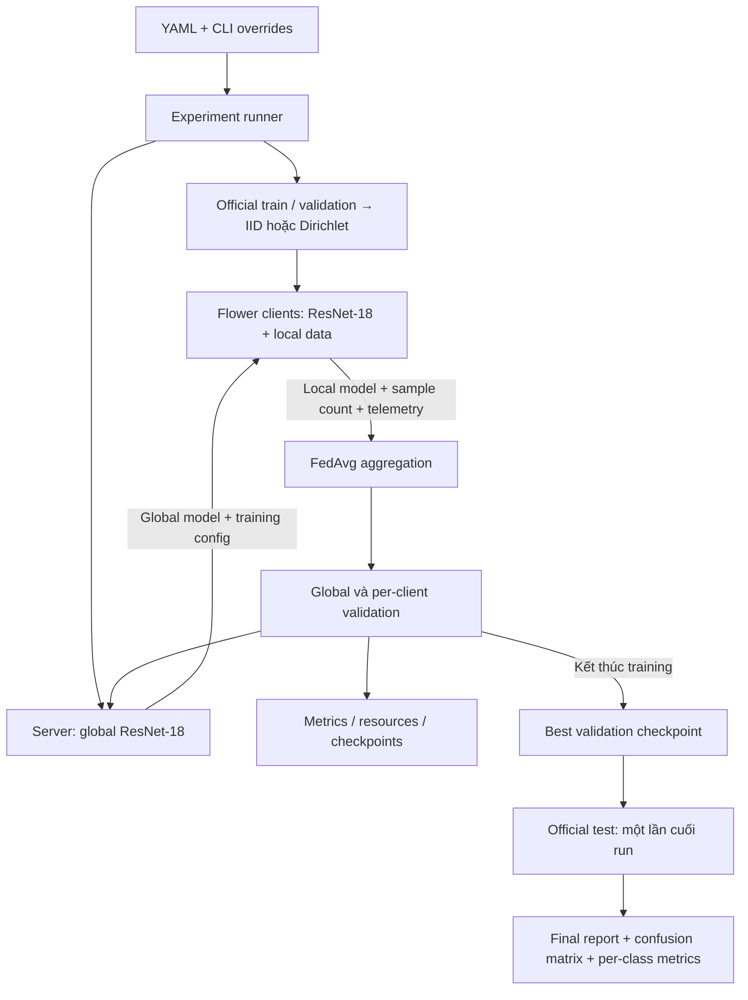

# FedMedAI — Federated Learning cho phân loại ảnh y tế 2D

FedMedAI là hệ thống thực nghiệm dùng **ResNet-18 làm mô hình chính**, kết hợp PyTorch và Flower để so sánh centralized learning, FedAvg và FedProx trên MedMNIST. **BloodMNIST** là dataset chính; **DermaMNIST** dùng cho thực nghiệm bổ sung trên một miền ảnh khác.

Tập trung vào ảnh hưởng của phân bố dữ liệu, thuật toán, số lượng client và tài nguyên tính toán. README mô tả hành vi của code hiện tại, cách chạy và cách diễn giải kết quả. **ResNet-18 là mặc định trong config, model factory và smoke test; BloodCNN chỉ là tùy chọn ablation.**

## Mục lục

1. [Tổng quan và phạm vi](#tong-quan)
2. [Kiến trúc và luồng xử lý](#kien-truc)
3. [Cấu trúc mã nguồn](#ma-nguon)
4. [Dataset và tiền xử lý](#du-lieu)
5. [Mô hình ResNet-18](#mo-hinh)
6. [Centralized, FedAvg và FedProx](#thuat-toan)
7. [Phân hoạch IID và non-IID](#phan-hoach)
8. [Cài đặt và chạy nhanh](#cai-dat)
9. [Chạy thực nghiệm và CLI](#thuc-nghiem)
10. [Tham số cấu hình](#cau-hinh)
11. [Evaluation và checkpoint selection](#danh-gia)
12. [Metrics, communication và tài nguyên](#metrics)
13. [File kết quả và cách sử dụng](#ket-qua)
14. [Tái lập và ablation](#tai-lap)
15. [Kiểm thử và xử lý lỗi](#kiem-thu)
16. [Lộ trình và tài liệu tham khảo](#lo-trinh)

<a id="tong-quan"></a>
## 1. Tổng quan và phạm vi

### Mục tiêu nghiên cứu

- So sánh chất lượng phân loại của FL với centralized baseline.
- Đo ảnh hưởng của label distribution skew lên FedAvg và hội tụ.
- Khảo sát FedProx dưới các mức non-IID; kết luận dựa trên thực nghiệm.
- Phân tích chênh lệch chất lượng giữa client và giữa các lớp ít mẫu.
- Ghi nhận model exchange, training time và tài nguyên sử dụng.

Hướng triển khai phần cứng trong kế hoạch là **5 Jetson Orin + 5 Jetson Nano**. Cần tách *statistical heterogeneity* — dữ liệu khác phân bố — khỏi *system heterogeneity* — thiết bị khác năng lực tính toán, bộ nhớ hoặc tốc độ.

### Trạng thái hiện tại

| Thành phần | Đã triển khai |
|---|---|
| Model | ResNet-18 chính; BloodCNN tùy chọn |
| Training | Centralized, FedAvg, FedProx với AdamW |
| Dữ liệu | MedMNIST single-label 2D, IID/Dirichlet, metadata tái lập |
| Backend | Flower/Ray virtual clients và sequential debug backend |
| Evaluation | Validation theo round/epoch; test cuối run bằng best validation checkpoint |
| Reporting | CSV, JSON, JSONL, checkpoints, TensorBoard |
| Monitoring | CPU/RAM, CUDA allocator và numeric sensor files tùy chọn |

Deployment nhiều Jetson qua mạng, transport tracing, dashboard fleet và resource-aware scheduling là các bước tiếp theo, chưa phải tính năng hoàn chỉnh của CLI hiện tại. Smoke tests chỉ kiểm tra pipeline trên tập con nhỏ; không thay thế benchmark đầy đủ hoặc chứng minh một thuật toán tốt hơn.

<a id="kien-truc"></a>
## 2. Kiến trúc và luồng xử lý

### Server–Client FL đồng bộ



Mỗi FL round thực hiện:

1. Server gửi global model và cấu hình local training tới tất cả client.
2. Client nạp model, tạo optimizer và học trên train partition của mình.
3. Client trả **toàn bộ model state**, số mẫu train và telemetry.
4. Server tổng hợp theo số mẫu. Kết quả được sắp theo logical client ID trước aggregation để ổn định thứ tự cộng số thực.
5. Server đánh giá model trên union của validation partitions, lưu checkpoint của round và cập nhật best checkpoint.
6. Client nhận model vừa tổng hợp và đánh giá local validation.
7. Server tổng hợp confusion matrices, tính fairness và ghi record hoàn chỉnh.

Hiện `fraction_fit = fraction_evaluate = 1.0`: mọi client tham gia cả fit và evaluate ở mọi round. Run yêu cầu đủ client thành công; không âm thầm tiếp tục với ít client hơn. Round 0 không tạo evaluation report.

### Ranh giới của mô phỏng

Training của mỗi client dùng partition đã gán. Tuy nhiên runner vẫn nạp dữ liệu trên cùng máy, và global validation dùng union của validation partitions. Đây chưa phải cấu hình deployment mà server hoàn toàn không truy cập validation data của các tổ chức.

Code chưa tích hợp differential privacy hoặc secure aggregation. Việc phân hoạch và model exchange là cơ chế tổ chức thực nghiệm hiện có; vận hành dữ liệu phân tán thực tế cần được thiết kế thêm khi deploy.

<a id="ma-nguon"></a>
## 3. Cấu trúc mã nguồn

```text
fedmedai/
├── configs/
│   ├── config.yaml                # Mặc định: ResNet-18
│   └── smoke.yaml                 # Kiểm tra ngắn: ResNet-18
├── scripts/
│   ├── run_experiment.py          # CLI chung centralized/federated
│   ├── run_iid.py                 # Entry point IID
│   ├── run_non_iid.py             # Một alpha hoặc alpha sweep
│   └── run_centralized.py         # Entry point centralized
├── src/fedmedai/
│   ├── model.py                   # Model factory, get/set weights
│   ├── dataset.py                 # MedMNIST wrapper và preprocessing
│   ├── partition.py               # IID, paired Dirichlet, pooled loader
│   ├── train.py                   # AdamW, cross-entropy, FedProx penalty
│   ├── evaluate.py                # Evaluation và failure sample IDs
│   ├── client.py                  # Flower NumPyClient và telemetry
│   ├── server.py                  # Aggregation, validation, checkpointing
│   ├── simulation.py              # Flower/Ray hoặc sequential
│   ├── centralized.py             # Baseline theo epoch
│   ├── runner.py                  # Chuẩn bị data và final test
│   ├── experiment.py              # Config, seed, manifest, CSV/JSON
│   └── monitoring/
│       ├── metrics.py             # Classification, fairness, straggler
│       └── resource.py            # Resource sampling và energy
├── tests/test_experiments.py       # Kiểm thử offline bằng unittest
├── results/                       # Báo cáo
├── checkpoints/                   # Model checkpoints
├── runs/                          # TensorBoard events
├── pyproject.toml                 # Package và dependencies
└── FedMedAI_Implementation_Plan_v2.md
```

Các lớp training/evaluation, orchestration và monitoring được tách riêng. Centralized và FL dùng chung cách tính classification metrics và artifact schema; thay backend không cần thay định dạng báo cáo.

<a id="du-lieu"></a>
## 4. Dataset và tiền xử lý

### Dataset

Các số lượng dưới đây được đối chiếu với `medmnist.INFO` của package sử dụng trong môi trường phát triển. MedMNIST cung cấp official train/validation/test splits; nguồn dữ liệu xem tại [MedMNIST](https://medmnist.com/).

| Dataset | Vai trò | Lớp | Train | Validation | Test | Input mặc định |
|---|---|---:|---:|---:|---:|---|
| BloodMNIST | Chính | 8 | 11.959 | 1.712 | 3.421 | RGB 28×28 |
| DermaMNIST | Bổ sung | 7 | 7.007 | 1.003 | 2.005 | RGB 28×28 |

Class IDs của BloodMNIST:

| ID | Tên lớp |
|---:|---|
| 0 | Basophil |
| 1 | Eosinophil |
| 2 | Erythroblast |
| 3 | Immature granulocytes: myelocytes, metamyelocytes, promyelocytes |
| 4 | Lymphocyte |
| 5 | Monocyte |
| 6 | Neutrophil |
| 7 | Platelet |

Tên lớp trong artifact lấy từ MedMNIST metadata. Khi đổi `dataset.name: DermaMNIST`, classifier tự có 7 outputs. Nếu khai báo `model.num_classes` không khớp metadata, config bị từ chối.

Loader chỉ hỗ trợ **single-label 2D**: binary-class hoặc multi-class. Dataset 3D, multi-label và ordinal regression không nằm trong pipeline hiện tại.

### Tiền xử lý

```text
Ảnh MedMNIST
 → convert RGB
 → resize nếu image_size khác 28
 → ToTensor: [0, 255] thành [0, 1]
 → Normalize(mean=0.5, std=0.5) trên ba kênh: khoảng [-1, 1]
 → Tensor [3, H, W], target là một class ID
```

Hiện chưa có data augmentation, class-weighted loss hoặc weighted sampling. Train loader shuffle; validation/test loader không shuffle.

`dataset.image_size` resize ảnh sau khi nạp. Loader không truyền tham số chọn MedMNIST+ native size: đổi thành 224 không tự chuyển sang bản dataset native 224×224.

`dataset.root: null` dùng cache mặc định của MedMNIST. `download: true` cho phép tải khi cần; `false` yêu cầu dữ liệu đã có.

<a id="mo-hinh"></a>
## 5. Mô hình ResNet-18

[model.py](src/fedmedai/model.py) dùng `torchvision.models.resnet18`, giữ nguyên backbone và thay lớp cuối bằng `Linear(512, num_classes)`. Stem convolution và max pooling vẫn là cấu trúc torchvision gốc, không có stem riêng cho ảnh nhỏ.

Kích thước tensor đã kiểm tra với input RGB 28×28:

| Thành phần | Mô tả | Output, bỏ chiều batch |
|---|---|---|
| Input | Ảnh đã normalize | 3×28×28 |
| `conv1`, `bn1`, `relu` | Conv 7×7, stride 2, 64 channels | 64×14×14 |
| `maxpool` | Max pooling | 64×7×7 |
| `layer1` | 2 residual BasicBlocks | 64×7×7 |
| `layer2` | 2 residual BasicBlocks | 128×4×4 |
| `layer3` | 2 residual BasicBlocks | 256×2×2 |
| `layer4` | 2 residual BasicBlocks | 512×1×1 |
| `avgpool` + flatten | Adaptive average pooling | 512 |
| `fc` | Linear classifier | 8 với BloodMNIST; 7 với DermaMNIST |

Với BloodMNIST, model có **11.180.616 trainable parameters**. Dữ liệu thô trong `state_dict`, gồm buffers, là **44.761.024 bytes** ở dtype mặc định đã kiểm tra. Checkpoint và serialized payload có thêm metadata; không đồng nhất số này với dung lượng file hoặc lưu lượng mạng.

`pretrained: false` là mặc định. Với `true`, backbone dùng `ResNet18_Weights.DEFAULT`, classifier cuối vẫn khởi tạo lại và toàn bộ model được fine-tune. Project không tự đổi preprocessing sang ImageNet transforms khi bật pretrained. Xem [torchvision ResNet-18](https://docs.pytorch.org/vision/stable/models/generated/torchvision.models.resnet18.html).

Để ablation model size, BloodCNN có thể được chọn rõ trong YAML:

```yaml
model:
  name: custom_cnn
  pretrained: false
```

BloodCNN gồm ba convolution blocks, adaptive average pooling và classifier; không có pretrained weights trong repository. Các cấu hình mặc định vẫn dùng ResNet-18.

<a id="thuat-toan"></a>
## 6. Centralized, FedAvg và FedProx

| Thuộc tính | Centralized | FedAvg | FedProx |
|---|---|---|---|
| Dữ liệu train | Union các partitions đã chọn | Local partition | Local partition |
| Đơn vị vòng lặp | Epoch | Round + local epochs | Round + local epochs |
| Objective | Cross-entropy | Cross-entropy | Cross-entropy + proximal penalty |
| AdamW state | Giữ qua các epoch | Khởi tạo lại mỗi local fit | Khởi tạo lại mỗi local fit |
| Aggregation | Không có | Weighted averaging | Như FedAvg |
| Model exchange | 0 trong schema | Theo payload | Theo payload |

### Centralized baseline

Centralized dùng union của đúng các mẫu đã chọn cho FL. Giữ nguyên partition config, caps và seed thì `partition_sha256` phải khớp giữa hai chế độ.

Mặc định `centralized_epochs = num_rounds × local_epochs`. Điều này giúp đối chiếu số lượt duyệt dữ liệu, nhưng không làm hai quá trình tối ưu tương đương: optimizer centralized giữ state liên tục, local optimizer được tạo lại mỗi round.

### FedAvg

```text
global_model_next = Σ_k (n_k / Σ_j n_j) × local_model_k
```

`n_k` là số mẫu train sau cap, không nhân với local epochs. Client trao đổi tensors từ toàn bộ `state_dict`, gồm BatchNorm buffers; chưa có chính sách giữ BatchNorm riêng kiểu FedBN. Thuật toán nền tảng: [McMahan et al., 2017](https://proceedings.mlr.press/v54/mcmahan17a.html).

### FedProx

```text
local_objective = cross_entropy + (mu / 2) × Σ_p ||p - p_global_start||²
```

Snapshot global parameters giữ nguyên trong local fit. Penalty áp dụng lên model parameters; server vẫn tổng hợp như FedAvg. `mu=0` đưa local objective về FedAvg.

Metrics `train_loss` vẫn báo **cross-entropy**, không cộng proximal penalty, để so sánh loss giữa thuật toán. Đây là implementation dùng AdamW của project, không phải khẳng định tái lập nguyên bộ benchmark trong [bài báo FedProx](https://arxiv.org/abs/1812.06127).

<a id="phan-hoach"></a>
## 7. Phân hoạch IID và non-IID

### IID

Shuffle indices rồi chia gần đều số mẫu giữa client. Không ép mỗi client chứa đúng tỷ lệ từng lớp. Train dùng experiment seed; validation dùng seed + 1.

### Paired Dirichlet

Với mỗi lớp, lấy tỷ lệ phân bổ vào K client từ Dirichlet(alpha). Train và validation dùng chung tỷ lệ, nhưng phân bổ số mẫu riêng theo từng split:

1. Sinh tỷ lệ phân bổ cho từng lớp.
2. Chia train và validation tương ứng.
3. Kiểm tra số mẫu tối thiểu/client; thử lại tối đa 500 lần.
4. Shuffle IDs từng client, áp dụng caps.
5. Lưu IDs, phân bố thực tế và hash metadata.

`min_train_samples` và `min_val_samples` là minima **trước cap** cho Dirichlet. Cap nhỏ hơn minima vẫn có thể làm số mẫu dùng thấp hơn minima. IID chỉ yêu cầu mỗi client có dữ liệu.

| Thiết lập | Diễn giải |
|---|---|
| `partition_type: iid` | IID theo shuffle và chia gần đều |
| Dirichlet α=1.0 | Thường ít lệch hơn các alpha nhỏ được khảo sát |
| Dirichlet α=0.3 | Mức non-IID trung gian trong ma trận thực nghiệm |
| Dirichlet α=0.1 | Mức non-IID mạnh trong ma trận thực nghiệm |

**Alpha 1.0 vẫn là Dirichlet, không được gắn nhãn IID.** Mức lệch thực tế phải đọc từ class distributions. Partition không khả thi sẽ báo lỗi, không chuyển âm thầm sang IID.

### Caps và sample IDs

`max_train_samples`, `max_val_samples` áp dụng **mỗi client**; `max_test_samples` áp dụng cho global test. `null` là không giới hạn; 0 không phải cách bỏ giới hạn.

Config chính với 3 client dùng tối đa 1.500 train và 300 validation samples; có thể ít hơn nếu một client có ít mẫu hơn cap. Metadata lưu cả allocated counts và counts thực sử dụng.

Sample ID là **zero-based index trong official split**, không phải ID bệnh nhân. Train ID 10 và test ID 10 thuộc hai namespace khác nhau.


<a id="cai-dat"></a>
## 8. Cài đặt và chạy nhanh

Chạy các lệnh từ thư mục gốc repository. Package khai báo Python >= 3.10.

### Tạo môi trường và cài dependencies

```powershell
python -m venv .venv

# Windows PowerShell
.\.venv\Scripts\Activate.ps1

python -m pip install --upgrade pip
python -m pip install -e .
```

Trên Linux/macOS, thay lệnh activate bằng:

```bash
source .venv/bin/activate
```

Dependencies gồm PyTorch, torchvision, Flower với simulation extra, MedMNIST, TensorBoard, PyYAML, NumPy và psutil. Flower được giới hạn `>=1.36.0,<1.37.0` trong [pyproject.toml](pyproject.toml), vì integration hiện dùng compatibility API `flwr.simulation.start_simulation`.

Kiểm tra CUDA mà process hiện tại nhìn thấy:

```bash
python -c "import torch; print('torch:', torch.__version__); print('CUDA:', torch.cuda.is_available())"
```

### Smoke test

Config chính bật download; smoke config tắt download. Nếu chưa có BloodMNIST trong cache mặc định, tải trước:

```bash
python -c "import medmnist; medmnist.BloodMNIST(split='train', download=True)"
```

Sau đó chạy:

```bash
python scripts/run_experiment.py --config configs/smoke.yaml
```

[smoke.yaml](configs/smoke.yaml) dùng ResNet-18, 3 client, 2 rounds, tối đa 32 train và 16 validation samples/client, 64 test samples, backend sequential. Output nằm riêng dưới `results/smoke`, `checkpoints/smoke`, `runs/smoke`.

Kiểm tra thêm đường đi Flower/Ray hoặc centralized:

```bash
python scripts/run_experiment.py --config configs/smoke.yaml --backend flower --rounds 1
python scripts/run_centralized.py --config configs/smoke.yaml
```

<a id="thuc-nghiem"></a>
## 9. Chạy thực nghiệm và CLI

### Các lệnh thường dùng

```bash
# Centralized baseline
python scripts/run_centralized.py

# FedAvg với IID
python scripts/run_iid.py

# FedAvg qua cả ba alpha 0.1, 0.3, 1.0
python scripts/run_non_iid.py

# Một alpha với FedProx
python scripts/run_non_iid.py 0.1 --algorithm fedprox --seed 42

# CLI chung: số client, rounds và seed
python scripts/run_experiment.py --partition dirichlet --alpha 0.3 --algorithm fedavg --num-clients 5 --rounds 20 --seed 123

# Centralized với cùng alpha và seed
python scripts/run_experiment.py --mode centralized --partition dirichlet --alpha 0.3 --seed 123
```

Centralized vẫn lấy số client để tạo partition từ YAML. Để đối chiếu đúng với run 5 client/20 rounds phía trên, đặt `federation.num_clients: 5`, `federation.num_rounds: 20` trong config dùng chung, đồng thời giữ caps và các training parameters nhất quán.

### CLI chung

| Flag trong `run_experiment.py` | Ý nghĩa |
|---|---|
| `--config PATH` | YAML; mặc định `configs/config.yaml` của repository |
| `--mode centralized\|federated` | Chế độ; mặc định federated |
| `--partition iid\|dirichlet` | Ghi đè partition |
| `--alpha FLOAT` | Dirichlet alpha; không dùng để chia IID |
| `--seed INT` | Experiment seed |
| `--algorithm fedavg\|fedprox` | Thuật toán FL |
| `--num-clients INT` | Số client FL |
| `--rounds INT` | Số FL rounds |
| `--backend flower\|sequential` | Backend FL |

Centralized nhận `--config`, `--partition`, `--alpha`, `--seed`. Các flag `--algorithm`, `--num-clients`, `--rounds`, `--backend` bị từ chối ở mode này; thiết lập số client để tạo partition và centralized epochs trong YAML.

- `run_iid.py`: CLI chung với partition mặc định IID.
- `run_centralized.py`: CLI chung với mode centralized.
- `run_non_iid.py`: CLI riêng gồm alpha positional tùy chọn, `--config`, `--algorithm`, `--seed`, `--backend`. Muốn đổi số client/rounds cho sweep, sửa YAML; với một run riêng có thể dùng CLI chung.

```bash
python scripts/run_experiment.py --help
python scripts/run_non_iid.py --help
```

### Dataset phụ và thực nghiệm đầy đủ

Tạo một bản config riêng, ví dụ `configs/full_derma.yaml`, với phần dataset:

```yaml
dataset:
  name: DermaMNIST
  image_size: 28
  download: true
  max_train_samples: null
  max_val_samples: null
  max_test_samples: null
```

Giữ các phần model/training/federation phù hợp rồi chạy:

```bash
python scripts/run_experiment.py --config configs/full_derma.yaml --partition iid
```

`full_derma.yaml` là tên ví dụ cần tự tạo, không phải file có sẵn. Với full BloodMNIST, giữ `name: BloodMNIST` và cũng đặt caps thành `null`.

<a id="cau-hinh"></a>
## 10. Tham số cấu hình

Nguồn chính: [configs/config.yaml](configs/config.yaml). Thứ tự áp dụng: **defaults trong code → YAML được chọn → CLI overrides**.

`smoke.yaml` là config riêng được bổ sung bằng defaults của code; nó không kế thừa các chỉnh sửa tùy ý trong `config.yaml`. `config.resolved.yaml` trong output lưu cấu hình sau overrides. Paths tương đối được giải theo working directory của lệnh chạy.

### Federation, model và training

| Key | Mặc định trong config chính | Ý nghĩa |
|---|---|---|
| `federation.num_clients` | 3 | Số partition/client |
| `federation.num_rounds` | 5 | FL rounds |
| `federation.partition_type` | `iid` | IID hoặc Dirichlet |
| `federation.dirichlet_alpha` | 0.3 | Dirichlet concentration |
| `federation.seed` | 42 | Experiment seed |
| `federation.min_train_samples` | 10 | Min train/client, trước cap, khi phân bổ Dirichlet |
| `federation.min_val_samples` | 1 | Min validation/client, trước cap, khi phân bổ Dirichlet |
| `algorithm.name` | `fedavg` | FedAvg hoặc FedProx |
| `algorithm.proximal_mu` | 0.01 | Chỉ dùng với FedProx |
| `model.name` | `resnet18` | Mô hình chính |
| `model.pretrained` | `false` | Khởi tạo backbone bằng ImageNet weights |
| `model.num_classes` | Suy ra từ dataset | Nếu khai báo phải khớp metadata |
| `training.batch_size` | 32 | Batch size train/validation/test |
| `training.local_epochs` | 1 | Epochs mỗi local fit |
| `training.learning_rate` | 0.0001 | AdamW learning rate |
| `training.weight_decay` | 0.01 | AdamW weight decay |
| `training.centralized_epochs` | `null` | Tự tính bằng rounds × local epochs |

### Dataset và evaluation

| Key | Mặc định | Ý nghĩa |
|---|---|---|
| `dataset.name` | `BloodMNIST` | Dataset class |
| `dataset.image_size` | 28 | Kích thước sau resize |
| `dataset.root` | `null` | Cache mặc định |
| `dataset.download` | `true` | Cho phép tải khi cần |
| `dataset.max_train_samples` | 500 | Cap mỗi client |
| `dataset.max_val_samples` | 100 | Cap mỗi client |
| `dataset.max_test_samples` | `null` | Cap toàn test; mặc định dùng full split |
| `evaluation.selection_metric` | `f1_macro` | Validation `f1_macro`, `accuracy` hoặc `loss` |
| `evaluation.target_accuracy` | 0.8 | Target validation accuracy; `null` tắt |
| `evaluation.max_failure_cases` | 100 | Số lỗi test tối đa được lưu; 0 tắt danh sách |

### Runtime, monitoring và paths

| Key | Mặc định | Ý nghĩa |
|---|---|---|
| `runtime.backend` | `flower` | Flower/Ray hoặc sequential |
| `runtime.deterministic` | `true` | Deterministic Torch operations |
| `runtime.torch_num_threads` | 1 | Torch CPU threads/process |
| `runtime.client_cpus` | 1 | Ray CPU allocation/client |
| `runtime.client_gpus` | 0.0 | Ray GPU allocation/client, từ 0 đến 1 |
| `runtime.ray_num_cpus` | 1 | Tổng CPU resources công bố cho Ray |
| `monitoring.enabled` | `true` | Resource sampling; khi tắt vẫn đo operation duration |
| `monitoring.interval_seconds` | 0.2 | Chu kỳ sampling |
| `monitoring.sensors` | `{}` | Numeric sensor files tùy chọn |
| `hardware.scenario` | `pc_simulation` | Nhãn kịch bản |
| `hardware.client_device_types` | `{}` | Client ID → nhãn thiết bị |
| `paths.results_dir` | `results` | Root báo cáo |
| `paths.checkpoints_dir` | `checkpoints` | Root checkpoints |
| `paths.runs_dir` | `runs` | Root TensorBoard |

Với 1 Ray CPU và mỗi client cần 1 CPU, client có thể được lập lịch lần lượt; 3 client không mặc định đồng nghĩa 3 jobs song song. Tăng concurrency bằng runtime resources phù hợp và ghi lại trong manifest.

Ví dụ cấp GPU resource cho Ray client:

```yaml
runtime:
  backend: flower
  client_cpus: 1
  client_gpus: 1.0
  ray_num_cpus: 1
```

Đây là scheduler allocation, không phải giới hạn cứng GPU memory. `get_device()` chọn CUDA nếu process nhìn thấy CUDA, nếu không dùng CPU. `client_gpus` chỉ tác động Ray workers; centralized và sequential chọn device trực tiếp. Bật GPU worker khi CUDA không khả dụng sẽ báo lỗi.

<a id="danh-gia"></a>
## 11. Evaluation và checkpoint selection

| Split | Mục đích | Thời điểm |
|---|---|---|
| Train | Cập nhật model bằng backpropagation | Local epochs hoặc centralized epochs |
| Validation | Theo dõi chất lượng, fairness, chọn best, đo target | Mỗi round/epoch |
| Test | Đánh giá checkpoint đã chọn | Một lần cuối run thành công |

Global validation là union của các validation samples đã chọn. Pooled client validation được tính từ cùng global model trên các local partitions; đó không phải một tập dữ liệu độc lập khác.

Sau training, runner nạp `best_model.pt` rồi mới tạo test loader và đánh giá. Nếu test có cap, lấy tập con ngẫu nhiên theo seed và lưu IDs, không lấy mặc định các phần tử đầu tiên.

### Chọn best

- `f1_macro` hoặc `accuracy`: validation cao hơn là tốt hơn.
- `loss`: validation thấp hơn là tốt hơn.
- Hòa điểm: giữ checkpoint được lưu trước.
- Round/epoch đầu vẫn tạo best checkpoint khi accuracy bằng 0.

Model selection không dùng test. Khi tune qua nhiều run, dùng validation để ra quyết định; liên tục chọn hyperparameters theo final test sẽ làm test mất vai trò held-out.

### Khác biệt schema giữa centralized và FL

Centralized dùng chung schema nên cột `round` trong `metrics.csv` là **epoch**. Summary dùng `best_epoch`, `completed_epochs`, `epochs_to_target`; `num_rounds` bằng 0. FL dùng `best_round`, `completed_rounds`, `rounds_to_target`.

`test_checkpoint_round` lấy từ trường `round` của checkpoint; với centralized đó cũng là epoch. Các cột pooled-client/fairness không áp dụng cho centralized và để trống.

<a id="metrics"></a>
## 12. Metrics, communication và tài nguyên

### 12.1. Classification

Accuracy, precision, recall và F1 nằm trong [0, 1]; CPU/GPU utilization dùng phần trăm [0, 100]. Loss là cross-entropy trung bình theo mẫu.

| Field | Ý nghĩa |
|---|---|
| `accuracy` | Tổng dự đoán đúng / tổng mẫu |
| `precision_macro`, `recall_macro`, `f1_macro` | Mean đều theo tất cả lớp đã cấu hình |
| `precision_weighted`, `recall_weighted`, `f1_weighted` | Mean theo support của lớp |
| `confusion_matrix` | Hàng = ground truth; cột = prediction |
| `per_class.support` | Số mẫu thật của lớp |
| `per_class.predicted_count` | Số lần dự đoán vào lớp |
| `per_class.correct` | Số dự đoán đúng trong lớp |
| `per_class.accuracy` | Recall của lớp: correct / support |
| `per_class.precision`, `recall`, `f1` | Chỉ số từng lớp |

Mẫu số bằng 0 cho tỷ số 0. Macro tính cả lớp không xuất hiện trong split được đánh giá; cần đọc cùng `support`, nhất là khi local validation nhỏ hoặc non-IID mạnh.

`client_train_loss` và `client_train_accuracy` là trung bình theo số mẫu giữa client. Training metrics của từng client được tích lũy từ minibatches trong lúc học qua các local epochs, không phải đánh giá lại model cuối trên toàn bộ train set.

### 12.2. Pooled metrics và fairness

Pooled precision/recall/F1 tính lại từ **tổng confusion matrices**. Không lấy weighted mean của từng client F1 rồi gọi là global F1.

Fairness cho trọng số bằng nhau giữa client:

| Field | Ý nghĩa |
|---|---|
| `mean_client_accuracy` | Mean accuracy giữa client |
| `client_accuracy_variance` | Population variance, `ddof=0` |
| `worst_client_accuracy` | Accuracy thấp nhất |
| `mean_client_f1_macro` | Mean macro F1 giữa client |
| `worst_client_f1_macro` | Macro F1 thấp nhất |

Per-client F1, confusion matrix và support nằm trong telemetry evaluation. `last_round_fairness` thuộc **model của round cuối**; final test thuộc **best validation checkpoint**. Hai model có thể khác nhau.

### 12.3. Hội tụ và thời gian

| Field | Phạm vi |
|---|---|
| Client `resources.duration_seconds` | Local training hoặc local evaluation được monitor |
| `client_train_seconds_sum` | Tổng local training duration |
| `fit_phase_seconds` | Từ configure fit đến sau aggregation, gồm overhead phase đó |
| `aggregation_seconds` | Thời gian gọi Flower aggregation |
| `global_validation_seconds` | Nạp weights, evaluate và ghi global validation report |
| `round_latency_seconds` | Wall time tới khi client validation đã được xử lý |
| `elapsed_training_seconds` | Từ configure fit của round đầu |
| `training_wall_seconds` | Lời gọi training; FL gồm khởi tạo backend/client, không gồm chuẩn bị dataset hoặc final test |
| `final_test_evaluation_seconds` | Đánh giá test, không gồm tải dataset |

`rounds_to_target`, `time_to_target_seconds`, `model_payload_bytes_to_target` ghi ở round hoàn tất đầu tiên có **global validation accuracy** đạt target. Metric chọn best có thể là F1/loss, nhưng target vẫn là accuracy.

Chưa đạt hoặc target bị tắt: thời điểm đạt là `null`, `target_reached: false`. Centralized dùng `epochs_to_target`.

### 12.4. Straggler

```text
slowest_client_train_seconds = max(times)
median_client_train_seconds  = median(times)
straggler_overhead_seconds   = max(times) - median(times)
estimated_wait_seconds_sum  = Σ_k [max(times) - time_k]
```

Đây là thống kê compute và ước lượng chờ theo client chậm nhất, không phải đo network latency hoặc waiting time thực. Sequential/Ray scheduling trên cùng máy không đại diện cho nhiều Jetson độc lập.

### 12.5. Communication

Đếm **bytes của serialized model tensors trong Flower Parameters**:

| Field | Nội dung |
|---|---|
| `fit_download_model_bytes` | Model gửi tới client cho fit |
| `fit_upload_model_bytes` | Model client trả sau fit |
| `evaluate_download_model_bytes` | Model gửi tới client cho evaluate |
| `round_model_payload_bytes` | Tổng ba loại trong round |
| `cumulative_model_payload_bytes` | Tích lũy đến round hiện tại |
| `total_model_payload_bytes` | Tổng run hoàn tất |

Không gồm RPC envelopes, scalar telemetry, handshake ban đầu hoặc retransmissions. Trong mô phỏng, đây là dung lượng model exchange tính từ payload, **không phải packet capture mạng**. Client `upload_seconds`, `download_seconds`, `waiting_seconds` hiện là `null` vì chưa có transport tracing.

### 12.6. Resource và energy

| Field trong client resources | Đơn vị / phạm vi |
|---|---|
| `cpu_utilization_percent_mean` | % CPU host |
| `process_rss_bytes_peak` | RSS process lớn nhất trong samples |
| `system_ram_used_bytes_peak` | RAM used của host lớn nhất trong samples |
| `gpu_memory_allocated_bytes_peak` | Peak allocated memory của PyTorch CUDA process |
| `gpu_utilization_percent_mean` | % từ sensor cấu hình |
| `temperature_c_max` | °C lớn nhất trong samples |
| `power_watts_mean` | Mean power samples, W |
| `energy_joules_observed` | Energy tích phân trên khoảng có dữ liệu, J |
| `energy_observed_seconds` | Tổng thời gian được tích phân |
| `resource_sample_count` | Số samples thu được |

CPU/RAM/sensors host có thể chịu ảnh hưởng từ process khác. RSS/temperature peak là peak quan sát theo sampling; CUDA memory là allocator của process, không phải toàn bộ GPU memory.

Ví dụ cấu trúc config cho numeric sensor files:

```yaml
monitoring:
  enabled: true
  interval_seconds: 0.2
  sensors:
    power_watts: {path: /path/to/whole_board_power_mw, scale: 0.001}
    temperature_c: {path: /path/to/temp_millicelsius, scale: 0.001}
    gpu_utilization_percent: {path: /path/to/gpu_load_permille, scale: 0.1}
```

Đây là placeholders. Giá trị đọc được nhân với `scale` để về W, °C hoặc %. Cần xác định sensor và power rail trên thiết bị thật. File không đọc được/giá trị không hợp lệ cho dữ liệu thiếu.

Energy tích phân hình thang trên các cặp power samples liên tiếp hợp lệ:

```text
energy_joules_observed = Σ [(P_i + P_(i+1)) / 2] × Δt_i
```

Không nối qua khoảng mất mẫu. Đọc `energy_observed_seconds` để biết độ phủ; đổi J sang Wh bằng cách chia 3.600.

`client_train_energy_joules_observed_sum` ở round/summary chỉ cộng cửa sổ local training có dữ liệu. Đọc cùng `clients_with_train_energy` của từng round. Nó không bao phủ server, communication, mọi phase hoặc toàn bộ thời gian chờ. `total_fleet_energy_joules` để `null` trong FL simulation; không cộng power của virtual clients cùng host rồi coi là nhiều board độc lập.


<a id="ket-qua"></a>
## 13. File kết quả và cách sử dụng

### Run ID và thư mục

Run ID gồm UTC timestamp + random suffix. Cùng ID xuất hiện dưới results/checkpoints/runs, nên chạy lại không ghi đè run trước.

| Loại run | Group dưới mỗi output root |
|---|---|
| FL IID | `iid/<algorithm>/<run_id>/` |
| FL Dirichlet | `non_iid/alpha_<alpha>/<algorithm>/<run_id>/` |
| Centralized IID | `centralized/iid/<run_id>/` |
| Centralized Dirichlet | `centralized/alpha_<alpha>/<run_id>/` |

Ví dụ FL non-IID:

```text
results/non_iid/alpha_0.3/fedprox/<run_id>/
├── run_manifest.json
├── config.resolved.yaml
├── partition_metadata.json
├── partition_summary.json
├── metrics.csv
├── client_metrics.csv
├── client_metrics.jsonl
├── rounds/
│   └── round_0001.json
├── evaluation/
│   ├── global_val_round_0001.json
│   ├── pooled_client_val_round_0001.json
│   ├── test.json
│   └── test_sample_ids.json
├── test_confusion_matrix.csv
├── test_per_class.csv
└── final_test_metrics.json

checkpoints/non_iid/alpha_0.3/fedprox/<run_id>/
├── global_round_1.pt
├── ...
└── best_model.pt

runs/non_iid/alpha_0.3/fedprox/<run_id>/
└── events.out.tfevents...
```

Centralized dùng `global_val_epoch_0001.json`, `epoch_1.pt`; thư mục `rounds/` vẫn theo schema chung.

### Ý nghĩa artifacts

| Artifact | Nội dung |
|---|---|
| `run_manifest.json` | ID/mode/status, timestamps, config, environment/package versions, source hashes, artifact paths, measurement notes, parameter count khi đã khởi tạo model |
| `config.resolved.yaml` | Config thực dùng, gồm defaults và CLI overrides |
| `partition_metadata.json` | Full train/validation IDs, histogram, counts, alpha, seed, policy, hash |
| `partition_summary.json` | Bản gọn bỏ sample IDs |
| `metrics.csv` | Một hàng mỗi FL round hoặc centralized epoch hoàn tất |
| `rounds/round_XXXX.json` | Record round có cấu trúc |
| `client_metrics.csv` | Scalar metrics flatten theo client/round/phase |
| `client_metrics.jsonl` | Mỗi dòng là một JSON telemetry, gồm resources và evaluation chi tiết |
| `evaluation/global_val_*.json` | Full global validation report |
| `evaluation/pooled_client_val_*.json` | Report từ tổng local confusion matrices |
| `evaluation/test.json` | Full test report và checkpoint round |
| `evaluation/test_sample_ids.json` | Test IDs, cách chọn full split/subset |
| `test_confusion_matrix.csv` | Ma trận nhãn thật/dự đoán với tên lớp |
| `test_per_class.csv` | Support, predicted count, correct và metrics từng lớp |
| `final_test_metrics.json` | Summary, final test scalars/report, best checkpoint, convergence, communication |

Float trong file không bị làm tròn xuống bốn chữ số. JSON dùng `null`, CSV dùng ô trống cho dữ liệu thiếu/không áp dụng; không dùng 0 để giả lập phép đo chưa có. Giá trị 0 thực, như model exchange của centralized, vẫn được lưu.

Manifest chuyển `running → completed` hoặc `running → failed`. Lỗi được bắt sau khi tạo run sẽ ghi loại lỗi và thông báo; process bị dừng đột ngột có thể để lại `running`. Khi strategy phát hiện thiếu client/failures, có thêm report ở `failures/`. Kiểm tra status trước khi đưa run vào so sánh.

### Cách đọc kết quả

1. Kiểm tra manifest/config: model, dataset, algorithm, seed, backend và status.
2. Đọc partition summary để biết dữ liệu thực dùng, đặc biệt khi có caps.
3. Dùng `metrics.csv` để vẽ validation learning curves, thời gian và payload.
4. Dùng client CSV/JSONL để xem fairness, local F1 và chênh lệch training time.
5. Đọc final test, per-class CSV và confusion matrix để phân tích best checkpoint.

Khi bật failure cases, danh sách nằm trong `test_evaluation.failure_cases` của final summary và `failure_cases` của `evaluation/test.json`. Mỗi entry có test sample ID, true class, predicted class và confidence của class dự đoán. Đây là các lỗi đầu tiên theo thứ tự evaluation, có giới hạn; không phải mẫu ngẫu nhiên đại diện cho mọi lỗi và không xuất ảnh riêng.

### Alpha comparison

`run_non_iid.py` lưu:

```text
<results_dir>/comparisons/<comparison_id>/
  alpha_comparison.csv
  alpha_comparison.json
```

Mỗi hàng có run ID, alpha, algorithm, seed, model, dataset, partition hash, final test accuracy/F1/precision/recall, best round, rounds to target, training time, total model payload và đường dẫn run.

Bảng cập nhật sau mỗi run thành công; sweep lỗi giữa chừng vẫn giữ kết quả trước đó. Hiện bảng này so sánh alpha trong một lần gọi, chưa tự tổng hợp mean/std qua nhiều seeds hoặc gộp mọi algorithm thành một bảng nghiên cứu.

### TensorBoard

```bash
tensorboard --logdir runs
```

Mở địa chỉ TensorBoard hiển thị, thường là `http://localhost:6006`.

| Chế độ | Tags điển hình |
|---|---|
| FL classification | `Round/global_val_accuracy`, `Round/global_val_f1_macro` |
| FL fairness | `Round/worst_client_accuracy`, `Round/client_accuracy_variance` |
| FL systems | `Round/round_latency_seconds`, `Round/cumulative_model_payload_bytes` |
| Centralized | `Validation/loss`, `Validation/accuracy`, `Validation/f1_macro` |

Client resource details chủ yếu ở CSV/JSONL. TensorBoard hiện không phải dashboard fleet có trạng thái online từng Jetson.

### Nạp checkpoint

Thay đường dẫn ví dụ bằng checkpoint của run cần đọc:

```python
import torch
from fedmedai.model import get_model

checkpoint = torch.load(
    "checkpoints/iid/fedavg/<run_id>/best_model.pt",
    map_location="cpu",
    weights_only=True,
)
model_config = checkpoint["model_config"]
model = get_model(
    model_name=model_config["name"],
    num_classes=model_config["num_classes"],
    pretrained=False,
)
model.load_state_dict(checkpoint["model_state_dict"])
model.eval()

print(checkpoint["selection_split"], checkpoint["selection_metric"])
print(checkpoint["validation_metrics"]["f1_macro"])
```

Checkpoint lưu model state và metadata selection, không lưu đầy đủ optimizer/RNG state để tự resume training. CLI chưa hỗ trợ resume run bị ngắt.

<a id="tai-lap"></a>
## 14. Tái lập và ablation

### Tái lập

Mỗi run lưu config, Python/package versions, platform, SHA-256 các Python source files trong package, partition hash và sample IDs. `partition_sha256` là hash metadata phân hoạch, không phải checksum toàn bộ file ảnh.

Python, NumPy, Torch và DataLoader được seed. Local fit dùng seed suy ra từ experiment seed, round và client ID. Deterministic mode bật mặc định; khác version thư viện/backend/phần cứng vẫn có thể gây khác biệt số học.

Dùng cùng code/environment, effective config và dataset, rồi đối chiếu partition hash/IDs. Hiện chưa có CLI replay trực tiếp từ `partition_metadata.json`.

### Ma trận thực nghiệm

| Câu hỏi | Biến thay đổi | Các điều kiện cần giữ nhất quán |
|---|---|---|
| Non-IID | IID; α=1.0/0.3/0.1 | Model, dataset, client count, training, backend |
| Thuật toán | FedAvg/FedProx; các mu | Partition/IDs, seed, rounds, local epochs, optimizer |
| Client count | 3/5/10 | Model/protocol; ghi rõ tổng mẫu thực dùng |
| Độ ổn định | Nhiều seeds | Các hyperparameters còn lại |
| Dataset phụ | BloodMNIST/DermaMNIST | Protocol nhất quán; classifier đổi theo số lớp |
| Hardware, sau khi deploy | Orin/Nano/mixed | IDs, model, batch size, local epochs, algorithm |

Caps áp dụng theo client nên tăng số client có thể làm tăng tổng dữ liệu. Nếu chỉ muốn đo ảnh hưởng client count, cần kiểm soát tổng sample count và mô tả điều kiện so sánh.

Ví dụ chạy nhiều seeds bằng PowerShell:

```powershell
foreach ($seed in 42, 123, 2024) {
    python scripts/run_experiment.py --partition dirichlet --alpha 0.3 --algorithm fedavg --seed $seed
}
```

Khi báo cáo nhiều seeds, tổng hợp các run cùng điều kiện và ghi mean/std cùng số seeds. Không thay `rounds_to_target: null` bằng 0 nếu run chưa đạt target; báo thêm số run đạt target.

### Artifact lịch sử

Run cũ không có `schema_version: 2` có thể chọn best checkpoint trên test; cần chạy lại để so sánh dưới protocol mới. Artifact BloodCNN cũ vẫn mô tả BloodCNN dù mặc định hiện tại là ResNet-18. Xác định model từ manifest/checkpoint thay vì suy đoán theo config hiện tại.

<a id="kiem-thu"></a>
## 15. Kiểm thử và xử lý lỗi

### Bộ kiểm thử

```bash
python -m unittest discover -s tests -v
```

Bộ kiểm thử hiện có 13 tests, dùng dữ liệu tổng hợp và temporary directories, không cần download dataset:

- Classification metrics, lớp vắng mặt, fairness và straggler.
- Failure sample IDs và energy integration khi có khoảng thiếu mẫu.
- Partition tái lập, không chồng lấn, không bỏ mất sample, không fallback IID.
- FedProx mu=0, ảnh hưởng mu dương và parameter exchange.
- Pipeline sequential, artifact schema, tính tái lập.
- Centralized dùng cùng partition; test chỉ được nạp cuối run.
- Best checkpoint khi accuracy=0, failed run và config không hợp lệ.

Tests này không thay thế kiểm tra network/CUDA/sensors trên thiết bị thật. Smoke BloodMNIST kiểm tra thêm data loader với dữ liệu thật; Flower/Ray cần được kiểm tra riêng bằng lệnh ở phần chạy nhanh.

### Các lỗi thường gặp

| Hiện tượng | Kiểm tra và xử lý |
|---|---|
| Smoke không có dataset | Smoke tắt download; tải BloodMNIST trước hoặc trỏ đúng root |
| Import error | Dùng đúng environment và cài `python -m pip install -e .` |
| `start_simulation` deprecated | Compatibility API đang dùng; project pin Flower 1.36, migration App/CLI là bước tiếp theo |
| Ray không lập lịch client | Kiểm tra `ray_num_cpus >= client_cpus`, GPU resources và CUDA |
| Dirichlet không khả thi | Xem client count, alpha, minima; điều chỉnh thiết kế/seed và ghi rõ |
| BatchNorm báo “more than 1 value per channel” | ResNet-18 với input 28×28 có feature map 1×1 ở cuối; kiểm tra minibatch chỉ 1 mẫu, kể cả batch cuối. Điều chỉnh sample counts/batch size để tránh singleton batch |
| GPU/power/temperature trống | CPU run, sensors chưa cấu hình/không đọc được hoặc monitoring tắt |
| Global accuracy khác mean client accuracy | Global weighted theo mẫu, fairness mean không weighted; dùng pooled accuracy để đối chiếu cùng scope |
| Local macro F1 thấp | Kiểm tra support; macro tính cả lớp vắng mặt |
| Target fields null | Chưa đạt target validation accuracy hoặc target tắt |
| Không có final report | Kiểm tra manifest, console và `failures/`; run có thể chưa hoàn tất |
| Checkpoints lớn | Mỗi round/epoch lưu một model và thêm best; ResNet-18 lớn hơn BloodCNN |

DataLoader hiện dùng `drop_last=False`; không tự bỏ singleton batch để tránh BatchNorm error. Nếu sửa chính sách batch, cần kiểm tra số mẫu thực sự tham gia training và tính công bằng của so sánh.

<a id="lo-trinh"></a>
## 16. Lộ trình và tài liệu tham khảo

Các bước tiếp theo theo định hướng v2:

1. Hoàn thiện lập luận chọn architecture và thuật toán từ literature review.
2. Chạy centralized/FedAvg với ResNet-18 trên dữ liệu đầy đủ, rồi khảo sát FedProx.
3. Bổ sung deployment/transport cho client Jetson Orin, sau đó Jetson Nano.
4. Đo Orin-only, Nano-only và mixed 5 Orin + 5 Nano với experimental controls.
5. Xác minh sensor units, power rails, communication time và energy coverage.
6. Xây dựng dashboard và phân tích bottleneck trước khi thử resource-aware scheduling/adaptive local epochs.

`hardware.scenario` và `client_device_types` chỉ là metadata. Gán nhãn “Orin”/“Nano” không biến virtual client trên PC thành thiết bị tương ứng. Input nhỏ cũng chưa chứng minh ResNet-18 phù hợp mọi giới hạn RAM/compute của Nano; cần đo training configuration thực tế.

FedBN, FedNova, SCAFFOLD và decentralized FL trong kế hoạch là hướng khảo sát/mở rộng, chưa phải tùy chọn CLI hiện có. TensorRT, nếu bổ sung, thuộc hướng tối ưu inference; training hiện dùng PyTorch.

Tài liệu liên quan:

- [MedMNIST — dataset và official splits](https://medmnist.com/).
- [torchvision ResNet-18](https://docs.pytorch.org/vision/stable/models/generated/torchvision.models.resnet18.html).
- [McMahan et al. — FedAvg](https://proceedings.mlr.press/v54/mcmahan17a.html).
- [Li et al. — FedProx](https://arxiv.org/abs/1812.06127).
- [Flower FedAvg strategy API](https://flower.ai/docs/framework/main/en/ref-api/flwr.server.strategy.FedAvg.html).

