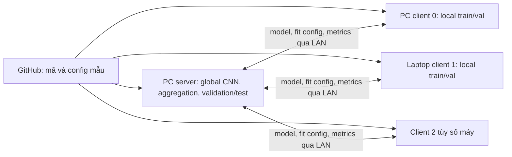

# Kế hoạch chuyển FedMedAI sang client thực tế

Ngày lập: 08/10/2026. Phạm vi được chọn: **PC/laptop trong cùng LAN trước**.
Đây là kế hoạch có thể điều chỉnh, chưa phải xác nhận triển khai đa máy thành công.

## Quyết định phương pháp

- Baseline: `fedavg`, aggregation theo số mẫu, uplink `none`.
- Cải thiện chính tạm thời: **Coverage + calibration**, ID `coverage_calibrated`.
- Cùng CNN hai block, cùng initialization/seed, partition IDs, preprocessing,
  batch size, optimizer, local epochs và số rounds cho hai phương pháp.
- Không dùng ID `proposed`: đó vẫn là extension chưa triển khai. FedProx và các
  ablation còn trong mã để kiểm thử; không nằm trong ma trận triển khai chính.
- Điểm khởi đầu từ phương pháp đã triển khai: `head_mu=1`, `coverage_kappa=32`,
  `logit_tau=1`, `prior_smoothing=1`. Không chọn lại hệ số bằng test set.

Với số mẫu **train cục bộ** `n_kc`, loss của phương pháp chính là:

```text
a_kc = kappa / (n_kc + kappa)
L_k = CE(z + tau * log(n_kc + epsilon), y)
      + head_mu / 2 * sum_c a_kc * ||head_kc - head_global_c||²
```

Head bao gồm weight và bias; reference được chụp khi bắt đầu local fit. Calibration
chỉ áp dụng lúc train; inference dùng logits gốc. Server vẫn tổng hợp FedAvg.
Vector class counts được tính local, không gửi trong fit telemetry. Server vẫn
nhận sample count, loss/head diagnostics và confusion matrix ở validation; ghi rõ
các thống kê này trong quy ước dữ liệu của pilot.

Nghiên cứu mô phỏng hiện có hỗ trợ việc giữ candidate để kiểm tra tiếp, nhưng chưa
chứng minh coverage weighting là nguyên nhân riêng của cải thiện. Không suy ra
chất lượng trên phần cứng thật. Nghiên cứu mở rộng đang tạm dừng **156/347** lượt;
discovery đã khóa LA-only, chưa có kết luận confirmation cuối. Việc chọn candidate
cho deployment là quyết định sản phẩm tạm thời, không ghi đè quyết định nghiên cứu.

## Hiện trạng và khoảng trống

| Hạng mục | Đã có | Cần bổ sung trước pilot ổn định |
|---|---|---|
| Kết nối | `server.server`, `client.client`, Flower 1.36.x | Cấu hình địa chỉ, timeout round, preflight trên từng máy |
| Thuật toán | Server truyền loss options xuống client; FedAvg và candidate dùng chung flow | Kiểm thử qua socket cho cả hai, nhiều client và hệ số không mặc định |
| Dữ liệu | Seed/partition tái lập; JSON indices và hash | Client đọc shard/manifest đã gán, kiểm tra không trùng train IDs |
| Validation | Server dùng union validation, client đánh giá local validation | Giữ endpoint này ở pilot BloodMNIST; thiết kế endpoint phân tán riêng nếu cần |
| Test | Best checkpoint theo validation; test ở cuối run | Xác minh server test đúng checkpoint và đúng một lần mỗi run |
| Danh tính | Kiểm tra logical ID trùng/ngoài miền lúc nhận kết quả | Handshake trước round 1: run ID, unique client ID, protocol/model/data hashes |
| Lỗi | Yêu cầu tất cả client thành công; có failure artifacts | Timeout có giới hạn, báo lỗi rõ, xử lý client trễ/mất mạng |
| Resume | Có checkpoint model và logs | Chưa có exact resume optimizer/RNG/client state; chạy pilot mới khi lỗi |
| Monitoring | CPU/RAM, sensors, thời gian round, payload tensor | Device label đúng từ local config; phân biệt byte payload với byte trên dây |
| Cài đặt | Python >=3.10; `flwr[simulation]` trong dependency chung | Tách core/network và extra simulation để client không phải cài Ray |

CLI hiện tại tạo tất cả partition từ toàn bộ train/val cache ở mỗi client và server
cũng cần train để dựng metadata. Copy JSON bằng SCP chưa khiến loader đọc JSON.
Pilot ban đầu dùng dữ liệu BloodMNIST công khai có thể chấp nhận full cache; chỉ
đánh dấu chế độ shard riêng đã đạt khi loader và test tương ứng được triển khai.

## Kiến trúc đích và cấu hình thay đổi được



Mỗi client chủ động kết nối server; chỉ server cần cổng Flower lắng nghe `8080`.
`0.0.0.0:8080` là bind address; client dùng IP LAN thật của server, không dùng
`0.0.0.0` hoặc `127.0.0.1` khi ở máy khác. IP/đường dẫn/credentials lưu trong
`configs/local/` đã ignore; không đưa host của phòng lab vào config công khai.

Cấu hình dự kiến, **chưa được loader/CLI hiện tại hỗ trợ đầy đủ**:

| Tệp dự kiến | Phạm vi cấu hình | Quy tắc |
|---|---|---|
| `configs/network/fedavg.yaml` | Protocol chung baseline | Được version hóa, không chứa host thật |
| `configs/network/coverage_calibrated.yaml` | Protocol candidate | Chỉ khác loss options và tên method với baseline |
| `configs/local/server.yaml` | bind IP/port, data/output paths, timeout | Riêng server; không đổi protocol khoa học |
| `configs/local/client_0.yaml` | client ID, server address, device, threads, data/shard path | Riêng từng máy; không tự ghi đè learning rate/local epochs |
| `configs/local/registry.yaml` | Client IDs và host/port quản trị thực tế | Preflight/monitoring; không phải danh tính đã xác thực |

CLI cần hợp nhất protocol + local config rồi lưu cả resolved config và canonical
protocol hash. Hash chung loại trừ địa chỉ, đường dẫn output, CPU/GPU, threads;
bao gồm model/schema, preprocessing, class mapping, partition policy, thuật toán
và hệ số, seed, số client/round, local epochs, batch size, optimizer. Từng client
báo riêng data hash và assignment ID; không yêu cầu mọi shard có cùng hash.
Server từ chối mismatch hoặc ID trùng trước training. Runtime config không được
tạo cảm giác TLS/device/shard options đã hoạt động khi code chưa hỗ trợ.

## Các giai đoạn và điều kiện đạt

| Bước | Công việc và deliverable | Điều kiện chuyển bước |
|---|---|---|
| P0 — chuẩn bị repo | README/run guide gọn, ignore nghiên cứu, kế hoạch này, kiểm tra bản export | Export đủ root packages và core tests; không phụ thuộc `research/` |
| P1 — chốt môi trường | Kiểm kê OS/CPU/RAM/GPU, số máy, IP server; tách optional Ray; pin bộ dependencies đã thử cho PC | Clone mới trên server và một laptop; import/model/loss CPU PASS; ghi versions/commit |
| P2 — config & preflight | Config mẫu hai method + local overrides; handshake/hash, timeout, device labels | Test mismatch ID/model/protocol, không đủ client và timeout đều từ chối đúng |
| P3 — smoke kết nối | 1 server + 2 client trên ít nhất 2 máy; dữ liệu công khai giới hạn; chạy riêng hai method 1–2 rounds | Đủ logical IDs mỗi round, truyền đúng coefficients, logs/metrics hữu hạn, best checkpoint/test đúng protocol |
| P4 — dữ liệu riêng từng client | Export/đọc shard train/val cùng manifest; server validation/test riêng; kiểm tra IDs/hashes | Client chạy được khi không có shard máy khác; train/val/test không lẫn; counts chỉ từ local train |
| P5 — pilot so sánh | Full BloodMNIST, cùng partition và seed cho hai method, 8 rounds/1 local epoch làm điểm đầu | Hoàn tất/audit cả cặp; macro-F1, per-class recall, fairness, round time và payload có provenance |
| P6 — mở rộng | Nhiều laptop, GPU/Jetson, VPN/TLS và transport mới theo nhu cầu | Mỗi thay đổi có compatibility/smoke test; protocol mới được ghi riêng |

P0 chỉ chuẩn bị nội dung chia sẻ; chưa bao gồm commit/push GitHub. P1–P6 là backlog,
không tự chạy lại nghiên cứu đã tạm dừng. Trước sửa executable source để triển khai,
tạo revision/check-out deployment riêng và bảo toàn source đã khóa cho nghiên cứu.
Không tái chạy suite cũ với source triển khai mới; lần resume phải theo amendment
đã nêu trong hồ sơ pause local.

## Pilot đầu tiên và đánh giá

Ưu tiên một server PC và hai client PC/laptop. Số client ban đầu là giả định có thể
đổi theo inventory; đặt `num_clients` bằng số client thực tế và tạo lại partition.
Thử 1–2 rounds trước, chưa cần đổi kiến trúc transport để chứng minh kết nối LAN.
Giữ Flower đang dùng `>=1.36,<1.37` trong pilot, ghi version cài thực tế.

- FedAvg giữ nguyên sample-weighted aggregation, không compression/server momentum.
- Candidate dùng cùng lịch training và pipeline; không thêm local-BN hoặc tự đổi
  batch size theo máy trong phép so sánh chính.
- Chọn checkpoint bằng global validation macro-F1. Test chỉ cuối run. Một test
  cuối mỗi run không đồng nghĩa được dùng test để retune hệ số giữa các run.
- Metrics: macro-F1/accuracy, per-class recall/confusion matrix, worst-client F1,
  train time từng client, round time, model payload. TCP ping là thời gian mở kết
  nối, không phải thời gian upload model. Power/energy chưa đo được ghi `null`.
- Thiếu/mất client: round không được chấp nhận; giữ failure receipt. Chưa tuyên bố
  hỗ trợ exact mid-run resume hoặc tự thay client. Sau lỗi chạy attempt mới có ID mới.
- Không đòi model PC và GPU giống từng bit; ghi environment và kiểm tra sai số có
  giới hạn trên fixture, audit partition/protocol chính xác.

## Transport và phần cứng ở các bước sau

`start_server`/`start_client` đang dùng là API deprecated; hướng duy trì dài hạn là
`ServerApp`/`ClientApp`, SuperLink/SuperNode. Tách migration thành bước riêng sau
pilot, với parity tests cho loss config, checkpoint, telemetry và failure policy.
Nguồn: [Flower start_server](https://flower.ai/docs/framework/ref-api/flwr.server.start_server.html),
[Flower start_client](https://flower.ai/docs/framework/ref-api/flwr.client.start_client.html).

Pilot LAN dùng dữ liệu công khai trên mạng lab được quản lý. Khi mở ra mạng khác,
bổ sung VPN/TLS và định danh client trước pilot ngoài LAN; CLI hiện tại chưa expose
certificate options. Không tự mở router/public port. Flower mô tả TLS và các API
trong [network communication](https://flower.ai/docs/framework/main/en/ref-flower-network-communication.html).

Jetson là backlog sau PC. Phải phân biệt **Jetson Nano đời cũ** với **Orin Nano**:
chúng thuộc các dòng JetPack khác nhau trong
[NVIDIA JetPack Archive](https://developer.nvidia.com/embedded/jetpack-archive).
Kiểm tra Python/PyTorch/CUDA wheel đúng thiết bị trước khi cam kết hỗ trợ; preset
batch/workers hiện tại không chứng minh cài đặt được. Dự án yêu cầu Python >=3.10
và torch >=2; không hạ dependency của toàn repo chỉ để hợp Nano cũ.

## Chính sách GitHub và hồ sơ local

Public: root training packages, CNN, dataset source, baseline/candidate losses,
CLI triển khai/mô phỏng thông thường, configs mẫu và core tests, hướng dẫn sử dụng.
Local/ignore: toàn bộ `research/` (xong và chưa xong), outputs/checkpoints/logs/data,
study configs/runners/report generators và test phụ thuộc protocol riêng, kế hoạch
nghiên cứu dài, STATUS/AGENTS local, địa chỉ và chứng chỉ riêng.

Không ignore `datasets/`, `algorithms/coverage.py`, `client/train.py` hay core tests.
Research modules trong `experiments/` cũng được ignore; training runtime không
import chúng. Thuật toán/utility đang sống vẫn có regression tests công khai.

`git rm --cached` chỉ bỏ khỏi index, giữ file trên máy. Các bản đã commit vẫn còn
trong Git history; ignore không xóa lịch sử hoặc dung lượng clone cũ. Chưa rewrite
history, commit hoặc push trong bước chuẩn bị này. Tạo clone/export sạch và chạy
`python -B -m unittest discover -s tests -v` trước phát hành; chạy test local riêng
vẫn bao gồm nghiên cứu khi các file local còn hiện diện.

Các quyết định còn thay đổi theo inventory: số client, OS, CPU/GPU, IP server,
chính sách firewall, khả năng dùng full cache ở P3 và yêu cầu shard ở P4. Mỗi thay
đổi protocol phải tạo revision mới; local path/IP có thể đổi mà không đổi protocol.
