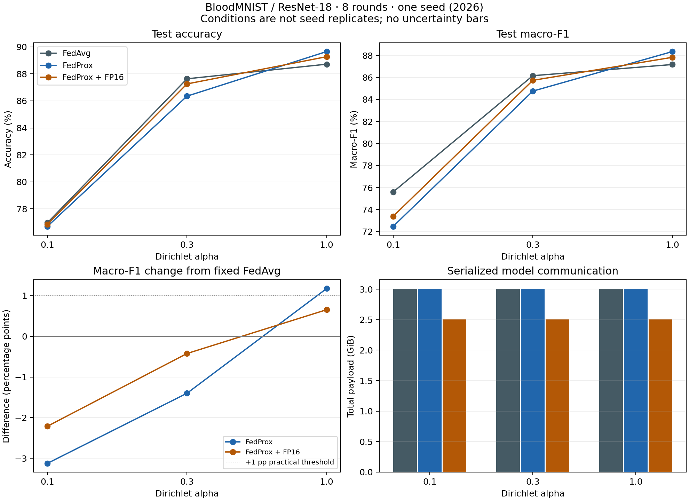

## Material Passport

- Origin Skill: ARS-Codex experiment-agent
- Origin Mode: run / validate
- Origin Date: 2026-09-26
- Verification Status: ANALYZED; exact FedAvg replay VERIFIED at α=0.3, seed=2026
- Version Label: non_iid_report_v1

## Kết quả

FedProx đạt ngưỡng cải thiện non-IID đã định trước tại α: **1.0**.
Ngưỡng: macro-F1 tăng ≥1 điểm phần trăm và accuracy không giảm so với FedAvg cùng α.
Δmacro-F1 của FedProx theo từng điều kiện: **α=0.1: -3.127 điểm; α=0.3: -1.401 điểm; α=1.0: +1.176 điểm**.
Kết quả không chứng minh FedProx cải thiện nhất quán ở cả ba mức non-IID.
FedProx+FP16 **KHÔNG ĐẠT** yêu cầu đạt đồng thời tiêu chí truyền thông ở cả ba α:
giảm ≥15% tổng payload, accuracy và macro-F1 giảm không quá 1 điểm phần trăm so với FedAvg.
Đây là tiêu chí kỹ thuật mô tả với một seed; không phải kiểm định ý nghĩa thống kê hay chứng minh noninferiority.

## Thiết kế đã khóa

FedAvg không nén là baseline cố định. Hai phương pháp so sánh là FedProx μ=0.01
và FedProx μ=0.01 kết hợp FP16 uplink. FedProx dùng proximal local objective thực sự;
server vẫn tổng hợp trọng số theo số mẫu như định nghĩa phương pháp. FP16 chỉ nén
uploads; training, aggregation và downloads giữ model dtype. Không chạy IID.

ResNet-18 không pretrained, BloodMNIST 28×28 đầy đủ (11,959 train / 1,712 val / 3,421 test),
3 clients tham gia mỗi round, 8 rounds, 1 local epoch, batch 32, AdamW lr=0.0001,
weight decay=0.01, reset optimizer mỗi fit; deterministic sequential CPU với 8 threads.
Seed 2026 chung cho mọi nhánh/α; chọn theo tính khả thi batch trước outcomes (seed 0/42
có batch cuối một ảnh gây lỗi BatchNorm). Không bỏ ảnh, không sweep μ hoặc chọn seed theo test.
Chọn checkpoint bằng pooled validation macro-F1, ưu tiên round sớm nhất khi bằng nhau;
test chỉ đánh giá cuối run. Cả 9 ô hoàn tất; replay thứ 10 không được tính là lần lặp thống kê.

Suite: `D:\FederatedLearning\fedmedai\results\non_iid_study\suite_20260926T103613Z`.
Execution: `2026-09-26T10:36:13.774330+00:00` → `2026-09-26T13:05:02.776503+00:00`, exit code 0.
Chi tiết: [protocol](non_iid_protocol.md), [khóa baseline](non_iid_baseline.lock.json),
[dữ liệu từng run](non_iid_runs.csv). Không dùng nghiên cứu BloodCNN cũ làm bằng chứng cho ResNet-18.

## Số đo từng điều kiện

Accuracy/macro-F1 là phần trăm; mỗi ô có một lần chạy, không có mean±SD hoặc CI qua seed.

| α | Phương pháp | Accuracy | Macro-F1 | Test loss | Best round | Upload MiB | Tổng MiB | Worst-client val accuracy |
|---:|---|---:|---:|---:|---:|---:|---:|---:|
| 0.1 | FedAvg | 76.966 | 75.601 | 0.5694 | 8 | 1024.856 | 3074.568 | 54.869 |
| 0.1 | FedProx | 76.703 | 72.474 | 0.6349 | 8 | 1024.856 | 3074.568 | 56.260 |
| 0.1 | FedProx + FP16 | 76.849 | 73.388 | 0.5917 | 8 | 512.609 | 2562.320 | 55.641 |
| 0.3 | FedAvg | 87.635 | 86.160 | 0.3568 | 6 | 1024.856 | 3074.568 | 83.824 |
| 0.3 | FedProx | 86.349 | 84.758 | 0.3865 | 6 | 1024.856 | 3074.568 | 80.699 |
| 0.3 | FedProx + FP16 | 87.255 | 85.737 | 0.3617 | 7 | 512.609 | 2562.320 | 81.250 |
| 1.0 | FedAvg | 88.717 | 87.174 | 0.3158 | 7 | 1024.856 | 3074.568 | 85.969 |
| 1.0 | FedProx | 89.652 | 88.350 | 0.2968 | 8 | 1024.856 | 3074.568 | 88.929 |
| 1.0 | FedProx + FP16 | 89.272 | 87.829 | 0.3108 | 8 | 512.609 | 2562.320 | 89.474 |

Worst-client accuracy dùng validation ở round cuối, không phải test theo client hoặc checkpoint đã chọn.
Per-class metrics, confusion matrices, sample IDs và validation curves nằm trong thư mục từng run.

### So với FedAvg cố định

| α | Phương pháp | Δaccuracy (pp) | Δmacro-F1 (pp) | Giảm upload | Giảm tổng payload | Ngưỡng non-IID | Ngưỡng truyền thông |
|---:|---|---:|---:|---:|---:|---|---|
| 0.1 | FedProx | -0.263 | -3.127 | 0.000% | 0.000% | không đạt | không đạt |
| 0.1 | FedProx + FP16 | -0.117 | -2.214 | 49.982% | 16.661% | không đạt | không đạt |
| 0.3 | FedProx | -1.286 | -1.401 | 0.000% | 0.000% | không đạt | không đạt |
| 0.3 | FedProx + FP16 | -0.380 | -0.423 | 49.982% | 16.661% | không đạt | đạt |
| 1.0 | FedProx | +0.935 | +1.176 | 0.000% | 0.000% | đạt | không đạt |
| 1.0 | FedProx + FP16 | +0.555 | +0.655 | 49.982% | 16.661% | không đạt | đạt |

### Ảnh hưởng riêng của FP16 trong FedProx

So sánh trực tiếp FedProx+FP16 trừ FedProx không nén; phần tiết kiệm byte thuộc codec FP16,
không được quy cho proximal term. Thay đổi chất lượng giữa hai nhánh thể hiện ảnh hưởng codec
trong quá trình training và lựa chọn checkpoint của lần chạy này.

| α | Δaccuracy (pp) | Δmacro-F1 (pp) | Giảm tổng payload |
|---:|---:|---:|---:|
| 0.1 | +0.146 | +0.913 | 16.661% |
| 0.3 | +0.906 | +0.978 | 16.661% |
| 1.0 | -0.380 | -0.521 | 16.661% |

### Kiểm tra phân bố client

Số ảnh train và tỷ trọng lớp lớn nhất của client 0 / 1 / 2. Cùng α dùng cùng partition ở mọi nhánh.

| α | Train counts | Tỷ trọng lớp lớn nhất |
|---:|---|---|
| 0.1 | 4497 / 7108 / 354 | 51.8% / 30.0% / 66.7% |
| 0.3 | 4779 / 3864 / 3316 | 47.9% / 30.7% / 43.9% |
| 1.0 | 3158 / 4002 / 4799 | 20.1% / 25.2% / 32.6% |



## Kiểm tra tính toàn vẹn

Đã kiểm tra mỗi sample ID xuất hiện đúng một lần trong partition của từng official split
(training vẫn lặp qua 8 rounds), partition/test IDs ghép cặp,
cấu hình và source hashes giống nhau ngoài treatment, μ hiệu dụng từng client-fit, đủ
8 rounds/3 clients, không lỗi client, validation selection và accounting bytes khớp từng round.
Tính lại accuracy/macro-F1 từ confusion matrices. Kiểm tra hash protocol/lock/runner snapshot.
Replay FedAvg α=0.3 khớp chính xác tensors checkpoint, test report/loss, round được chọn,
partition hash, validation và payload mỗi round. Replay không bao phủ cả 9 ô hoặc máy khác.

## Diễn giải và giới hạn

Mức tin cậy: **CAUTION**. Một seed cho mỗi điều kiện không đo được biến thiên do seed; ba α
là ba điều kiện, không phải ba mẫu lặp. Không gộp chúng thành mean±SD hoặc kiểm định thống kê.
Client partitions là label skew tổng hợp, không đại diện ba bệnh viện hoặc scanner/domain shift.
Tám rounds không chứng minh hội tụ; μ=0.01 và lịch AdamW cố định không phải tối ưu mọi thuật toán.
FedProx không thay cơ chế BatchNorm thành local BN; không gọi kết quả này là FedBN.
Không đánh giá FedNova/SCAFFOLD hoặc client sampling; không xếp hạng các thuật toán chưa chạy.

Payload gồm NumPy tensor headers, fit uploads/downloads và evaluation downloads; loại RPC
envelopes, telemetry, bảo mật, retries. Không suy ra tiết kiệm thời gian mạng/năng lượng từ byte.
Không dùng timing để tuyên bố speedup. BloodMNIST phân loại loại tế bào máu, không chứng minh
chẩn đoán bệnh, bảo vệ riêng tư, độ tin cậy lâm sàng hoặc hiệu năng Jetson.
Test set đã xuất hiện trong nghiên cứu BloodCNN trước; đây không phải holdout mới chưa quan sát.
Thiết kế mới không dùng test để tune μ/seed. Phương pháp kết hợp là kiểm chứng kỹ thuật của
thuật toán/codec có sẵn, không tuyên bố thuật toán mới hay novelty đã được thẩm định toàn diện.

### ARS statistical fallacy scan — 11/11

| Kiểm tra | Xử lý |
|---|---|
| Simpson's paradox | Báo riêng từng α; không che điều kiện thất bại bằng trung bình. |
| Ecological fallacy | Không suy luận bệnh nhân/bệnh viện từ virtual clients. |
| Berkson's paradox | Giới hạn chọn benchmark; không suy rộng quần thể lâm sàng. |
| Collider bias | Không điều chỉnh covariate theo outcomes; treatment cố định trước training. |
| Base rate neglect | Dùng accuracy cùng macro-F1, giữ class supports/confusion matrices. |
| Regression to the mean | Seed theo khả thi batch, không chọn kết quả cực trị; cần nhiều seed để khái quát. |
| Survivorship bias | Bắt buộc đủ chín ô; giữ mọi kết quả âm. |
| Look-elsewhere effect | Hai câu hỏi và ngưỡng định trước; không sweep test hay nhiều kiểm định. |
| Garden of forking paths | Lưu protocol trước ma trận; đây là local protocol, không đăng ký preregistration. |
| Correlation/causation | Đối chiếu có kiểm soát trong simulation; không suy ra tác động lâm sàng. |
| Reverse causality | Treatment đặt trước kết quả; không có tuyên bố thời gian quan sát. |

### Ghi nhận gián đoạn theo dõi

Có khoảng chờ thực tế dài hơn yêu cầu; nguyên nhân chưa xác minh. Không dùng
thời gian của suite này để suy luận speedup. Dữ liệu dưới đây chỉ ghi nhận quan sát:

- 2026-09-26T18:09:31+07:00: yêu cầu chờ 50 s, tool ghi nhận 688.118 s. Unexpected monitoring gap; cause unverified. Worker still running, only one additional completed round observed. Do not infer speed comparisons.

## Tái lập và nguồn

```powershell
python -B -m unittest discover -s tests -v
python -B -u scripts/run_non_iid_study.py
python -B scripts/report_non_iid_study.py results/non_iid_study/<suite_directory>
```

Runner tạo suite mới, dừng khi lỗi hoặc quá deadline 4 giờ, kiểm tra lại khi máy resume.
Không chạy lại lệnh training chỉ để xem báo cáo; lệnh report đọc artifacts hiện có.

[FedAvg — McMahan et al.](https://proceedings.mlr.press/v54/mcmahan17a.html),
[FedProx — Li et al.](https://arxiv.org/abs/1812.06127),
[MedMNIST v2](https://www.nature.com/articles/s41597-022-01721-8),
[nguồn BloodMNIST](https://data.mendeley.com/datasets/snkd93bnjr/1).

ARS-Codex hỗ trợ thiết kế, code và báo cáo. Review kỹ thuật dùng agent cùng model family
và shared context; không phải peer review bên ngoài hoặc xác minh cross-model.
